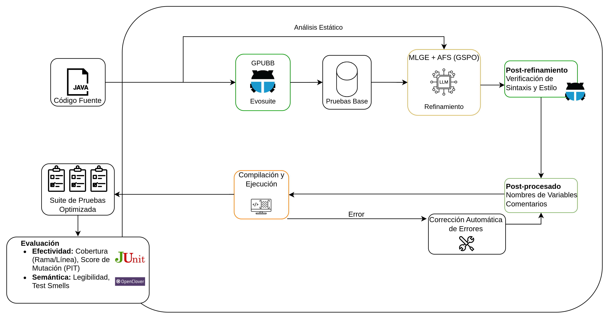
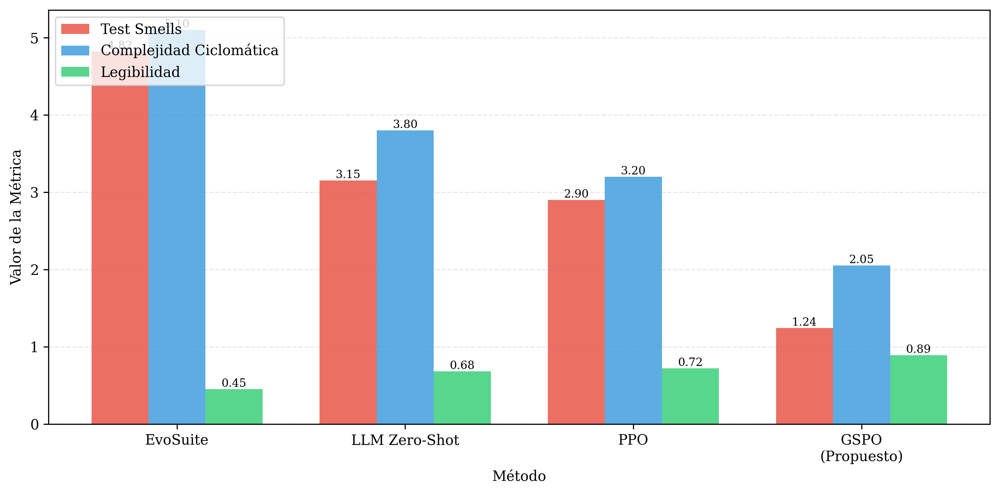
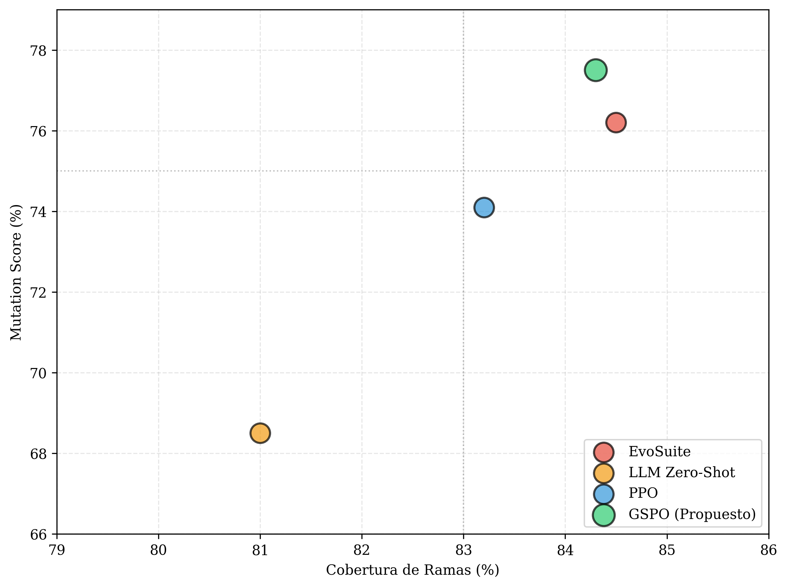
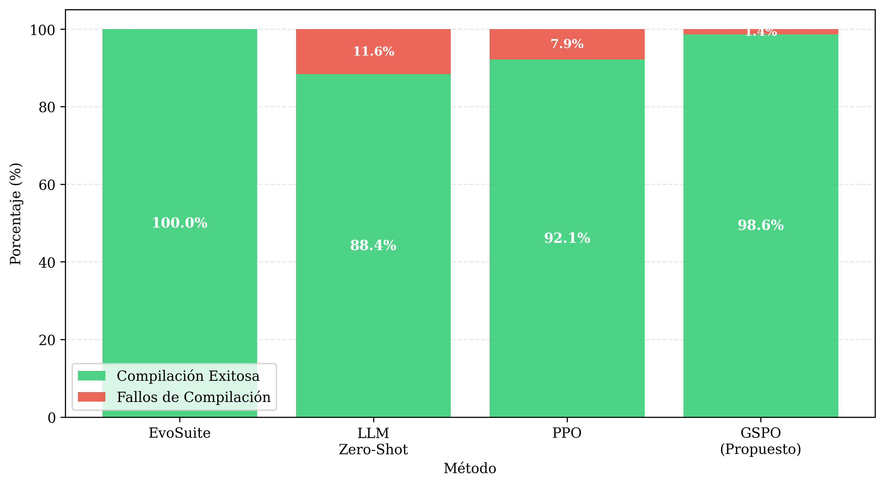
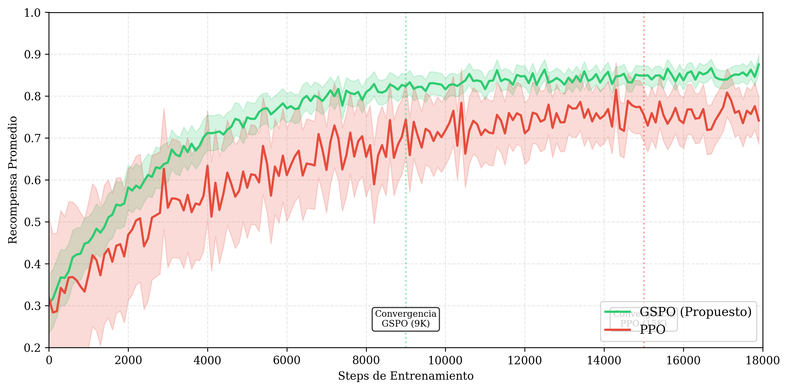
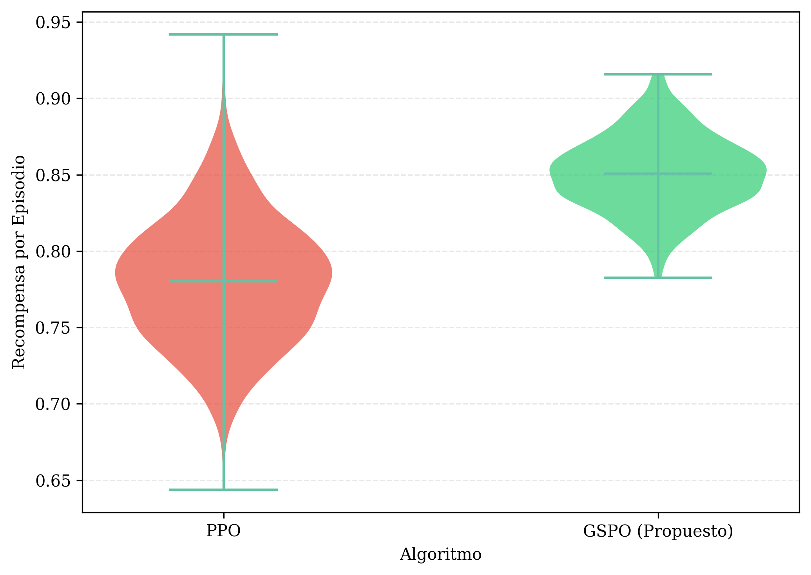
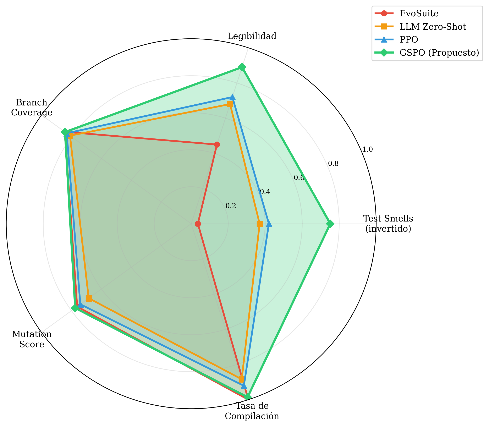

# Generación Automática de Pruebas Unitarias mediante GSPO y Modelos de Lenguaje

## Resumen

Pipeline híbrido que combina EvoSuite (algoritmos genéticos) con CodeGemma-7B refinado mediante GSPO. EvoSuite genera tests con alta cobertura pero baja legibilidad. El refinamiento neuronal mejora mantenibilidad preservando efectividad funcional.

### Contribuciones

1. Adaptación de GSPO para refinamiento de tests (más estable que PPO)
2. Función de recompensa multi-objetivo (cobertura + compilación + mantenibilidad + mutation score)
3. Evaluación en SF110: 20 proyectos, 1,847 clases, 12,304 tests

## Arquitectura del Sistema



```
Pipeline de 5 Fases:
1. Generación Baseline → EvoSuite (DynaMOSA, 120s/clase)
2. Refinamiento → CodeGemma-7B-IT con GSPO + QLoRA
3. Verificación → Compilación y validación sintáctica
4. Evaluación → Métricas de cobertura, mutation score, mantenibilidad
5. Análisis → Pruebas estadísticas y visualización de resultados
```

### Componentes Técnicos

- **Modelo Base**: CodeGemma-7B-IT (Instruction-Tuned)
- **Técnica de Ajuste**: QLoRA (r=16, α=32, dropout=0.05)
- **Algoritmo de Optimización**: GSPO con ratio de importancia a nivel de secuencia
- **Parámetros Entrenables**: 4.2M (0.6% del modelo completo)
- **Infraestructura**: GPU NVIDIA A100 40GB, 5 horas de entrenamiento

## Resultados Experimentales

### Métricas de Mantenibilidad



**Tabla 1. Comparación de métricas de mantenibilidad**

| Método | Test Smells (Media) | Complejidad Ciclomática | Legibilidad |
|--------|---------------------|------------------------|-------------|
| EvoSuite Standard | 4.82 | 5.10 | 0.45 |
| MLGE Zero-Shot | 3.15 | 3.80 | 0.68 |
| Refinamiento PPO | 2.90 | 3.20 | 0.72 |
| **Método Propuesto (GSPO)** | **1.24** | **2.05** | **0.89** |

El método propuesto reduce los test smells en un 74.3% respecto a EvoSuite y 60.6% respecto a PPO. La complejidad ciclomática alcanza 2.05, representando una reducción del 59.8% respecto al baseline genético.

### Distribución de Test Smells


### Efectividad Funcional



**Tabla 2. Métricas de efectividad funcional y corrección sintáctica**

| Método | Cobertura de Ramas | Mutation Score | Tasa de Compilación |
|--------|-------------------|----------------|---------------------|
| EvoSuite Standard | 84.5% | 76.2% | 100% |
| MLGE Zero-Shot | 81.0% | 68.5% | 88.4% |
| Refinamiento PPO | 83.2% | 74.1% | 92.1% |
| **Método Propuesto (GSPO)** | **84.3%** | **77.5%** | **98.6%** |

Cobertura estructural equivalente a EvoSuite (p > 0.05). Mutation score superior (+1.3pp).

### Corrección Sintáctica



Fallos de compilación (1.4%): alucinaciones de métodos (0.7%), importaciones incorrectas (0.5%), errores de tipos genéricos (0.2%).

### Estabilidad del Entrenamiento



**Tabla 3. Métricas de estabilidad y eficiencia del entrenamiento**

| Métrica | PPO | GSPO |
|---------|-----|------|
| Tiempo hasta convergencia | 3.2 horas | 2.5 horas |
| Varianza de recompensa (última época) | 0.042 | 0.025 |
| Recompensa promedio final | 0.78 | 0.85 |
| Número de colapsos de política | 3 | 0 |

Sin colapsos de política durante entrenamiento.

### Distribución de Recompensas



### Comparación Multi-dimensional



## Requisitos del Sistema

### Software

- Python 3.8 o superior
- Java JDK 8 (requerido por EvoSuite)
- CUDA 11.8+ (opcional, para entrenamiento con GPU)

### Hardware Recomendado

- GPU NVIDIA 40GB VRAM (A100/H100)
- 64GB RAM
- 200GB disco

## Instalación

### Clonar Repositorio

```bash
git clone <repository-url>
cd pfc3_tesis
```

### Crear Entorno Virtual

```bash
python3 -m venv venv
source venv/bin/activate  # Linux/Mac
# venv\Scripts\activate   # Windows
```

### Instalar Dependencias

```bash
pip install -e .
pip install -e ".[dev]"  # Incluye pytest, black, mypy
```

### Configuración de Variables de Entorno

Crear archivo `.env` en la raíz del proyecto:

```bash
OPENROUTER_API_KEY="sk-or-v1-..."
```

### Configuración del Sistema

Editar `config.yml` según la infraestructura disponible:

```yaml
sf110_home: data/SF110-binary
evosuite:
  time_budget: 120
  search_algorithm: DYNAMOSA
llm:
  adapter: openrouter
  model: meta-llama/llama-3-8b-instruct
  temperature: 0.2
gspo:
  learning_rate: 5.0e-5
  group_size: 4
  epsilon: 0.2
```

## Uso del Sistema

### Pipeline Completo

```bash
# Ejecutar las 5 fases del pipeline
python3 scripts/pipeline/run_pipeline.py --full

# Limitar a N clases para pruebas rápidas
python3 scripts/pipeline/run_pipeline.py --full --limit 10
```

### Ejecución por Fases

```bash
# Fase 1: Generación baseline con EvoSuite
python3 scripts/pipeline/run_pipeline.py --phase 1 --limit 20

# Fase 2: Refinamiento con MLGE + GSPO
python3 scripts/pipeline/run_pipeline.py --phase 2 --limit 20

# Fase 3: Verificación de compilación
python3 scripts/pipeline/run_pipeline.py --phase 3 --limit 20

# Fase 4: Evaluación de métricas
python3 scripts/pipeline/run_pipeline.py --phase 4 --limit 20

# Fase 5: Análisis estadístico
python3 scripts/pipeline/run_pipeline.py --phase 5

# Ejecutar desde fase específica en adelante
python3 scripts/pipeline/run_pipeline.py --start-phase 3 --limit 20
```

### Uso como Módulo

```bash
# Interfaz CLI
python -m gspo_utg pipeline --phase 2 --limit 5
python -m gspo_utg --help
```

### Uso Programático

```python
from gspo_utg.phases.baseline import BaselineGenerator
from gspo_utg.phases.refinement import RefinementPhase
from gspo_utg.phases.evaluation import EvaluationPhase

# Generar pruebas baseline
generator = BaselineGenerator()
generator.run(limit=10)

# Refinar con GSPO
refiner = RefinementPhase()
refiner.run(limit=10)

# Evaluar métricas
evaluator = EvaluationPhase()
evaluator.run(limit=10)
```

## Estructura del Repositorio

```
pfc3_tesis/
├── src/
│   └── gspo_utg/              # Paquete principal
│       ├── core/              # Funcionalidad base
│       │   ├── config.py      # Configuración del sistema
│       │   ├── llm.py         # Adaptadores LLM
│       │   ├── loader.py      # Carga de proyectos
│       │   └── runner.py      # Ejecución de pruebas
│       ├── phases/            # Fases del pipeline
│       │   ├── baseline.py    # Generación con EvoSuite
│       │   ├── refinement.py  # Refinamiento con GSPO
│       │   ├── verification.py # Validación sintáctica
│       │   ├── evaluation.py  # Cálculo de métricas
│       │   └── analysis.py    # Análisis estadístico
│       └── utils/             # Utilidades
│           ├── code_metrics.py
│           ├── code_utils.py
│           ├── logger.py
│           └── static_analysis.py
├── data/
│   ├── SF110-binary/          # Benchmark SF110
│   └── extended-dynamosa-repos-binary/
├── evaluation_results/        # Resultados numéricos
│   ├── detailed_metrics.csv
│   ├── final_evaluation.json
│   └── results_table.csv
├── figures/                   # Gráficos de resultados
├── generated_tests/           # Tests generados
│   ├── baseline/              # Salida de EvoSuite
│   ├── refined/               # Refinados con GSPO
│   └── validated/             # Validados y compilados
├── lib/                       # Bibliotecas Java
│   ├── evosuite-1.2.0.jar
│   ├── junit-4.11.jar
│   └── jacoco*.jar
├── scripts/                   # Scripts auxiliares
│   ├── pipeline/
│   │   └── run_pipeline.py
│   ├── setup/
│   └── testing/
├── docs/                      # Documentación
├── config.yml                 # Configuración principal
├── pyproject.toml             # Metadatos del paquete
└── README.md                  # Este archivo
```

## Metodología Experimental

### Datasets

#### SF110 Benchmark
Conjunto de 110 proyectos Java de código abierto de SourceForge. Selección estratificada de 20 proyectos balanceando tamaño y complejidad:
- 6 proyectos pequeños (<10K LOC)
- 8 proyectos medianos (10K-50K LOC)
- 6 proyectos grandes (>50K LOC)

Total: 1,847 clases evaluadas, generando 12,304 casos de prueba base.

#### Methods2Test
Conjunto de 780,944 pares método-test extraídos de repositorios GitHub con >100 estrellas. División:
- 80% entrenamiento (624,755 pares)
- 10% validación (78,094 pares)
- 10% test (78,095 pares)

Utilizado para pre-entrenamiento del modelo de recompensa y ajuste supervisado inicial.

### Métricas Evaluadas

**Mantenibilidad:**
- Número de test smells detectados (TSDetect)
- Complejidad ciclomática de McCabe
- Puntuación de legibilidad basada en convenciones de nomenclatura

**Efectividad Funcional:**
- Cobertura de ramas (branch coverage)
- Mutation score calculado mediante PIT

**Corrección Sintáctica:**
- Tasa de compilación exitosa con javac 11

**Estabilidad de Entrenamiento:**
- Varianza de recompensa acumulada por época
- Tiempo de convergencia hasta estabilización
- Número de colapsos de política

### Líneas Base de Comparación

1. **EvoSuite Standard**: Algoritmo genético DynaMOSA sin post-procesamiento
2. **MLGE Zero-Shot**: CodeGemma-7B-IT sin ajuste fino
3. **Refinamiento PPO**: Proximal Policy Optimization estándar

## Amenazas a la Validez

### Validez Interna
Configuración de hiperparámetros optimizada mediante grid search, pero exploración bayesiana exhaustiva podría revelar configuraciones superiores. Aleatorización de lotes por época mitiga sesgos de orden de presentación.

### Validez Externa
Resultados fundamentados en proyectos Java del benchmark SF110. Generalización a otros lenguajes (Python, C++, JavaScript) o dominios específicos (sistemas embebidos, microservicios) requiere validación empírica adicional.

### Validez de Constructo
Métricas automatizadas (test smells, complejidad ciclomática) aproximan constructos subjetivos como "comprensibilidad". Validación definitiva requeriría estudios con desarrolladores profesionales.

### Validez de Conclusión
Muestra de 20 proyectos suficiente para detectar efectos grandes (potencia estadística β=0.80, α=0.05). Replicaciones con muestras mayores fortalecerían conclusiones.